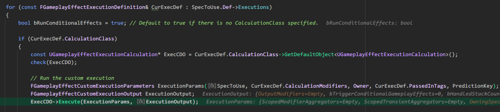

在演示的场景里，放着3个Volume，分别是DamageVolume，HealthManaStaminaVolume，HealthManaStaminaRegenVolume。作为场景里最简单的元素，本文分析下这3个Volume是如何使用GAS来实现效果的。

# DamageVolume


## BP_DamageVolume

BP_DamageVolume是实现的蓝图，如下图

该蓝图持有一个碰撞盒组件Box，一个表示伤害的数值Damage，和一个用于触发伤害的GE(GamePlayEffect)Class
蓝图的逻辑非常简单，每隔1秒查询Box里是否存在活着的Character。如果有就通过[GameplayEffectSpec]([BillEliot/GASDocumentation_Chinese (github.com)](https://github.com/BillEliot/GASDocumentation_Chinese#459-gameplayeffectspec))上的[SetByCaller]([BillEliot/GASDocumentation_Chinese (github.com)](https://github.com/BillEliot/GASDocumentation_Chinese#4591-setbycaller))值将伤害值传入伤害执行计算。
GameplayEffectSpec可以看作是GamePlayEffect的一个实例。通过MakeOutgoingSpec，传入GamePlayEffect进行实例的创建。
使用SetByCaller，修改Tag：Data.Damage的Magintude的值，然后把这个修改后的实例，传入ApplyGameplayEffectToSelf应用到角色身上，造成伤害。

在SetByCaller中，单纯只是把Data.Damage这个Tag和Magintude值关联起来，具体怎么应用这个Tag和关联的值，还要看这个GE是如何Apply到Attribue上的。

## GE_DamageVolume

GE_DamageVolume是BP_DamageVolume持有的GE，用来实例化造成伤害的GameplayEffectSpec，看看这个GE的配置。


GE的类型是Instant(即刻)，没有配置Modifiers，在Executions配置了UGDDamageExecCalculation类。这个类继承自UGameplayEffectExecutionCalculation，用于执行Attribute计算。实际对角色造成伤害，修改角色的生命值也是这个类。

通过断点进入这个类的Execute函数



遍历这个GE配置的Executions，找到对应的计算类，调用Exectue，把需要的参数传进去。返回FGameplayEffectCustomExecutionOutput

```cpp
void UGDDamageExecCalculation::Execute_Implementation(const FGameplayEffectCustomExecutionParameters & ExecutionParams, OUT FGameplayEffectCustomExecutionOutput & OutExecutionOutput) const
{
	UAbilitySystemComponent* TargetAbilitySystemComponent = ExecutionParams.GetTargetAbilitySystemComponent();
	UAbilitySystemComponent* SourceAbilitySystemComponent = ExecutionParams.GetSourceAbilitySystemComponent();

	AActor* SourceActor = SourceAbilitySystemComponent ? SourceAbilitySystemComponent->GetAvatarActor() : nullptr;
	AActor* TargetActor = TargetAbilitySystemComponent ? TargetAbilitySystemComponent->GetAvatarActor() : nullptr;

	const FGameplayEffectSpec& Spec = ExecutionParams.GetOwningSpec();

	// Gather the tags from the source and target as that can affect which buffs should be used
	const FGameplayTagContainer* SourceTags = Spec.CapturedSourceTags.GetAggregatedTags();
	const FGameplayTagContainer* TargetTags = Spec.CapturedTargetTags.GetAggregatedTags();

	FAggregatorEvaluateParameters EvaluationParameters;
	EvaluationParameters.SourceTags = SourceTags;
	EvaluationParameters.TargetTags = TargetTags;

	float Armor = 0.0f;
	ExecutionParams.AttemptCalculateCapturedAttributeMagnitude(DamageStatics().ArmorDef, EvaluationParameters, Armor);
	Armor = FMath::Max<float>(Armor, 0.0f);

	float Damage = 0.0f;
	// Capture optional damage value set on the damage GE as a CalculationModifier under the ExecutionCalculation
	ExecutionParams.AttemptCalculateCapturedAttributeMagnitude(DamageStatics().DamageDef, EvaluationParameters, Damage);
	// Add SetByCaller damage if it exists
	Damage += FMath::Max<float>(Spec.GetSetByCallerMagnitude(FGameplayTag::RequestGameplayTag(FName("Data.Damage")), false, -1.0f), 0.0f);

	float UnmitigatedDamage = Damage; // Can multiply any damage boosters here
	
	float MitigatedDamage = (UnmitigatedDamage) * (100 / (100 + Armor));

	if (MitigatedDamage > 0.f)
	{
		// Set the Target's damage meta attribute
		OutExecutionOutput.AddOutputModifier(FGameplayModifierEvaluatedData(DamageStatics().DamageProperty, EGameplayModOp::Additive, MitigatedDamage));
	}

	// Broadcast damages to Target ASC
	UGDAbilitySystemComponent* TargetASC = Cast<UGDAbilitySystemComponent>(TargetAbilitySystemComponent);
	if (TargetASC)
	{
		UGDAbilitySystemComponent* SourceASC = Cast<UGDAbilitySystemComponent>(SourceAbilitySystemComponent);
		TargetASC->ReceiveDamage(SourceASC, UnmitigatedDamage, MitigatedDamage);
	}
}
```

在这个GE里，Target和Source是同一个对象，都是玩家自己，也就是说这个伤害是自己对自己造成的。在伤害计算流程里，有个Armor的减伤值，这个Armor的值是怎么得来的还没看懂，断点调试到处乱飞，先记录一下后面再看看。

然后通过GetSetByCallerMagnitude，传入Data.Damage这个Tag，把在蓝图里传入的Damage值获取到。再进行伤害公式的计算，把最终计算的结果添加到OutExecutionOutput里，然后广播ReveiveDamage。

在获取到OutExecutionOuput之后，遍历这个这个结构体的Modifiers，对生命的Attribute进行修改

