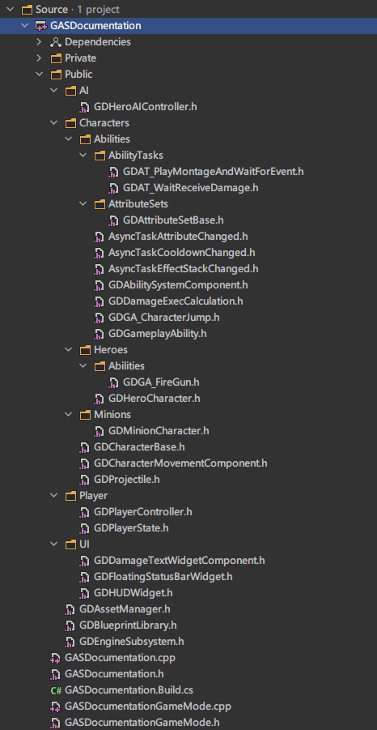
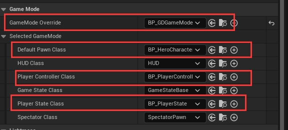

在[GASDocumentation](https://github.com/tranek/GASDocumentation)中附带了一个简单的GAS示例项目，是很好学习GAS的示例工程。本系列主要分析工程源码来学习GAS。

首先看一下C++代码目录



可以看到代码量并不多，代码的核心部分都在Character目录下。首先分析下非Character目录下的代码。

## GameMode



在GameMode设置里，可以看到项目重写了GameMode，Pawn，PlayerController，PlayerState，先从这部分代码入手。

### GDGameMode

```cpp
UCLASS(minimalapi)
class AGASDocumentationGameMode : public AGameModeBase
{
	GENERATED_BODY()

public:
	AGASDocumentationGameMode();

	void HeroDied(AController* Controller);

protected:
	float RespawnDelay;

	TSubclassOf<class AGDHeroCharacter> HeroClass;

	AActor* EnemySpawnPoint;

	virtual void BeginPlay() override;

	void RespawnHero(AController* Controller);
};
```

GameMode这里主要处理角色死亡的一些全局逻辑，在构造函数中缓存HeroClass。在角色死亡的函数HeroDied里，角色死亡后会Spawn ASpectatorPawn 这时角色可以以自由相机的Pawn进行操作。同时设置5秒后复活的Timer。在复活函数RespawnHero里，Spawn HeroClass，然后用AController::Possess附身在Hero上。

BeginPlay缓存敌人角色的复活点用于复活。

### PlayerController

```cpp
UCLASS()
class GASDOCUMENTATION_API AGDPlayerController : public APlayerController
{
	GENERATED_BODY()
	
public:
	void CreateHUD();

	UPROPERTY(EditAnywhere, Category = "GASDocumentation|UI")
	TSubclassOf<class UGDDamageTextWidgetComponent> DamageNumberClass;

	class UGDHUDWidget* GetHUD();

	UFUNCTION(Client, Reliable, WithValidation)
	void ShowDamageNumber(float DamageAmount, AGDCharacterBase* TargetCharacter);
	void ShowDamageNumber_Implementation(float DamageAmount, AGDCharacterBase* TargetCharacter);
	bool ShowDamageNumber_Validate(float DamageAmount, AGDCharacterBase* TargetCharacter);

	// Simple way to RPC to the client the countdown until they respawn from the GameMode. Will be latency amount of out sync with the Server.
	UFUNCTION(Client, Reliable, WithValidation)
	void SetRespawnCountdown(float RespawnTimeRemaining);
	void SetRespawnCountdown_Implementation(float RespawnTimeRemaining);
	bool SetRespawnCountdown_Validate(float RespawnTimeRemaining);

protected:
	UPROPERTY(BlueprintReadWrite, EditAnywhere, Category = "GASDocumentation|UI")
	TSubclassOf<class UGDHUDWidget> UIHUDWidgetClass;

	UPROPERTY(BlueprintReadWrite, Category = "GASDocumentation|UI")
	class UGDHUDWidget* UIHUDWidget;

	// Server only
	virtual void OnPossess(APawn* InPawn) override;

	virtual void OnRep_PlayerState() override;
};
```

PlayerController也没什么好说的，主要都是对UI的操作。

比较值得注意的是在OnPossess里调用了UAbilitySystemComponent::InitAbilityActorInfo()，在这个项目里一共有4处地方调用了这个函数，不清楚为什么需要在这么多个地方确保调用，感觉不太优雅。

### PlayerState

```cpp
UCLASS()
class GASDOCUMENTATION_API AGDPlayerState : public APlayerState, public IAbilitySystemInterface
{
	GENERATED_BODY()
	
public:
	AGDPlayerState();

	// Implement IAbilitySystemInterface
	class UAbilitySystemComponent* GetAbilitySystemComponent() const override;

	class UGDAttributeSetBase* GetAttributeSetBase() const;

	UFUNCTION(BlueprintCallable, Category = "GASDocumentation|GDPlayerState")
	bool IsAlive() const;

	UFUNCTION(BlueprintCallable, Category = "GASDocumenation|GDPlayerState|UI")
	void ShowAbilityConfirmCancelText(bool ShowText);


	/**
	* Getters for attributes from GDAttributeSetBase. Returns Current Value unless otherwise specified.
	*/

	UFUNCTION(BlueprintCallable, Category = "GASDocumentation|GDPlayerState|Attributes")
	float GetHealth() const;
    
    // ...

protected:
	UPROPERTY()
	class UGDAbilitySystemComponent* AbilitySystemComponent;

	UPROPERTY()
	class UGDAttributeSetBase* AttributeSetBase;

	FGameplayTag DeadTag;

	FDelegateHandle HealthChangedDelegateHandle;
	// ...

	// Called when the game starts or when spawned
	virtual void BeginPlay() override;

	// Attribute changed callbacks
	virtual void HealthChanged(const FOnAttributeChangeData& Data);
	//...

	// Tag change callbacks
	virtual void StunTagChanged(const FGameplayTag CallbackTag, int32 NewCount);
};
```

在示例项目中，PlayerState是比较重要类的，持有ASC和AttributeSet。在文档中说到

**其中`AbilitySystemComponent(ASC)`分别位于`PlayerState`类代表玩家/AI控制的人物和位于`Character`类代表AI控制的小兵**

在UE4中，每个可控制的人物都会有一个PlayerState，用于网络数据复制/同步等操作，在PlayerState里添加ASC也是为了网路同步。对Attribute的所有操作以及回调也是在持有AttributeSet的类里实现。


