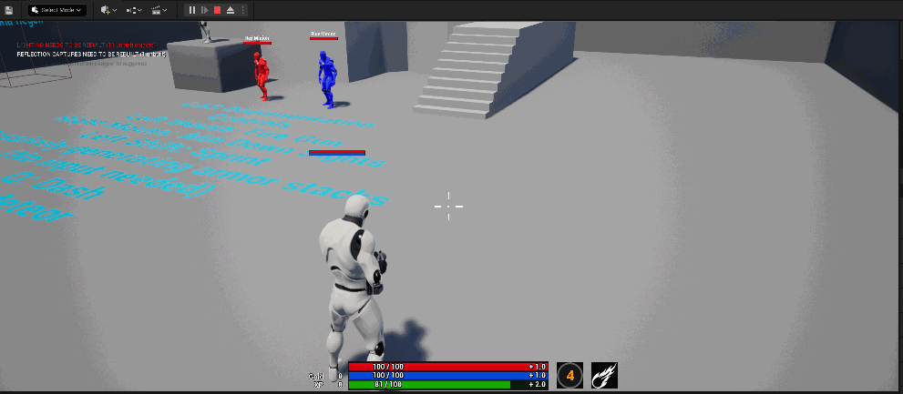

按下Q会触发冲刺，本文分析一下冲刺的实现以及参数是如何具体作用到位移的



## 技能与输入绑定

在SetupPlayerInputComponent或OnRep_PlayerState会调用AGDHeroCharacter::BindASCInput

```cpp
void AGDHeroCharacter::BindASCInput()
{
	if (!ASCInputBound && AbilitySystemComponent.IsValid() && IsValid(InputComponent))
	{
		AbilitySystemComponent->BindAbilityActivationToInputComponent(InputComponent, FGameplayAbilityInputBinds(FString("ConfirmTarget"),
			FString("CancelTarget"), FString("EGDAbilityInputID"), static_cast<int32>(EGDAbilityInputID::Confirm), static_cast<int32>(EGDAbilityInputID::Cancel)));

		ASCInputBound = true;
	}
}
```

```cpp
UENUM(BlueprintType)
enum class EGDAbilityInputID : uint8
{
	// 0 None
	None			UMETA(DisplayName = "None"),
	// 1 Confirm
	Confirm			UMETA(DisplayName = "Confirm"),
	// 2 Cancel
	Cancel			UMETA(DisplayName = "Cancel"),
	// 3 LMB
	Ability1		UMETA(DisplayName = "Ability1"),
	// 4 RMB
	Ability2		UMETA(DisplayName = "Ability2"),
	// 5 Q
	Ability3		UMETA(DisplayName = "Ability3"),
	// 6 E
	Ability4		UMETA(DisplayName = "Ability4"),
	// 7 R
	Ability5		UMETA(DisplayName = "Ability5"),
	// 8 Sprint
	Sprint			UMETA(DisplayName = "Sprint"),
	// 9 Jump
	Jump			UMETA(DisplayName = "Jump")
};
```


具体可详见文档[4.6.2 绑定输入到ASC](https://github.com/BillEliot/GASDocumentation_Chinese#462-%E7%BB%91%E5%AE%9A%E8%BE%93%E5%85%A5%E5%88%B0asc)

## 冲刺的实现

描述冲刺的GA文件名是GA_Dash_BP，核心部分如下


实现根运动位移启动了一个ApplyRootMotionConstantForce的AbilityTask。因为施加力是一个持续的过程，所以需要一个异步Task来执行。

在设置好根运动所需的参数之后，调用UAbilityTask_ApplyRootMotionConstantForce::SharedInitAndApply()，创建FRootMotionSource_ConstantForce对象，这个对象继承自FRootMotionSource，描述的是一个恒力作用的根运动，把之前设置的参数设置给这个对象，调用CharacterMovementComponent::ApplyRootMotionSource(TSharedPtr<FRootMotionSource> SourcePtr)，开始执行根运动。

## Todo CharacterMovementComponent如何执行根运动
