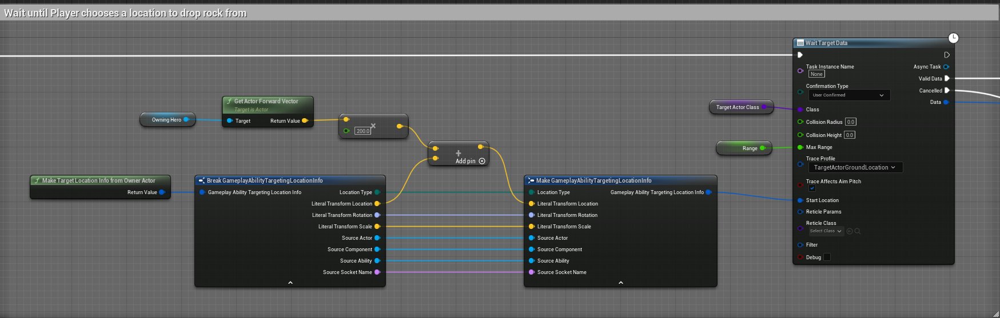

在演示项目中，用R可以激活召唤陨石的技能，需要确认陨石释放的位置才会正常释放，在等待确认状态时，可以取消该技能，可以作为投掷物技能的示例。


# GA_Meteor_BP


先看一下类的默认配置，配置有需要消耗30点Mana的Cost和5s的cd两个GE。和一些用于技能生成对象的Class。

## UAbilityTask_WaitTargetData

这个技能会激活UAbilityTask_WaitTargetData



这个Task有两个版本，1，是传入Class去生成TargetActor。2是传入已有的TargetActor。在示例项目里使用的是前者，传入TargetActor的Class和SpawnActor需要的参数。

### TargetActor如何生成

TargetActor是通过UAbilityTask_WaitTargetData的BeginSpawningActor函数生成。

在激活Task前，K2Node_LatentGameplayTaskCall会自动调用名为BeginSpawningActor的函数，这些在蓝图里自动调用的名字是注册在

```cpp
struct FK2Node_LatentAbilityCallHelper
{
    static FName WorldContextPinName;
    static FName ClassPinName;
    static FName BeginSpawnFuncName;
    static FName FinishSpawnFuncName;
    static FName BeginSpawnArrayFuncName;
    static FName FinishSpawnArrayFuncName;
    static FName SpawnedActorPinName;
};

FName FK2Node_LatentAbilityCallHelper::WorldContextPinName(TEXT("WorldContextObject"));
FName FK2Node_LatentAbilityCallHelper::ClassPinName(TEXT("Class"));
FName FK2Node_LatentAbilityCallHelper::BeginSpawnFuncName(TEXT("BeginSpawningActor"));
FName FK2Node_LatentAbilityCallHelper::FinishSpawnFuncName(TEXT("FinishSpawningActor"));
FName FK2Node_LatentAbilityCallHelper::BeginSpawnArrayFuncName(TEXT("BeginSpawningActorArray"));
FName FK2Node_LatentAbilityCallHelper::FinishSpawnArrayFuncName(TEXT("FinishSpawningActorArray"));
FName FK2Node_LatentAbilityCallHelper::SpawnedActorPinName(TEXT("SpawnedActor"));
```

在 UK2Node_LatentGameplayTaskCall::ExpandNode 里，会把蓝图指定的Class信息读出来，暴露出对应参数的pin。在编译蓝图时把这些信息绑定，在执行结点前调用注册好的函数（此处的调用流程非常复杂，各种蓝图字节码的解析，还没看懂，后续了解一下蓝图源码）

### TargetActor的作用

TargetActor是派生自AGameplayAbilityTargetActor的Actor，通过AbilityTask生成。用于辅助技能，搜集释放技能所需要的信息，调用方需要传给TargetActor搜集信息所需的参数。在示例项目里，使用AGameplayAbilityTargetActor_GroundTrace，在重写的AGameplayAbilityTargetActor_GroundTrace::PerformTrace函数里，通过碰撞检测得到被Hit到的对象信息。

## BP_Meteor

获得了指定范围内的信息后，生成伤害GE的实例和眩晕GE的实例


如此一来，用于生成陨石的所有信息就准备好了，使用SpawnActor，传入对应的参数，生成陨石


在生成完陨石后，技能结束。

技能结束了，陨石的效果在创建出来的陨石Actor上处理。

陨石的蓝图是BP_Metor，这个Actor派生自AGDProjectile

```cpp
UCLASS()
class GASDOCUMENTATION_API AGDProjectile : public AActor
{
    GENERATED_BODY()

public:    
    // Sets default values for this actor's properties
    AGDProjectile();

    UPROPERTY(BlueprintReadWrite, EditAnywhere, Meta = (ExposeOnSpawn = true))
    float Range;

    UPROPERTY(BlueprintReadWrite, Meta = (ExposeOnSpawn = true))
    FGameplayEffectSpecHandle DamageEffectSpecHandle;

    UPROPERTY(BlueprintReadOnly, VisibleAnywhere)
    class UProjectileMovementComponent* ProjectileMovement;

protected:
    // Called when the game starts or when spawned
    virtual void BeginPlay() override;
};
```

这个Actor包含内置的抛体移动组件UProjectileMovementComponent，用于陨石下落的模拟。

在蓝图中，监听了OnComponentBeginOverlap(SphereCollision)事件，当碰撞发生时，查找碰撞对象中所有派生自GDCharacterBase的类，并对他们应用伤害GE和眩晕GE，执行完毕后销毁自身。

# 眩晕

眩晕的实现可分成三个部分：

1，播放眩晕特效

2，播放眩晕动画

3，无法移动

4，取消正在执行的动作，如瞄准

在被陨石击中后，会应用GE_MeteorStun，这个GE把State.Debuff.Stun这个Tag附加到对象身上，顺着这个Tag就能找到对应的实现。

## 眩晕特效 GC_Stun

在GE_MeteorStun的Display中配置了GamePlayCue.Share.Stun的Tag


在GC_Stun中也注册了这个Tag


当附加GE时，这个对应Tag的GC因为勾选了AotuAttachtoOwner，就会自动附加到对象身上。

### 播放眩晕动画

参考瞄准/奔跑/冲刺等实现

### 无法移动

参考瞄准/奔跑

### 取消正在执行的动作

在Character/PlayState的BeginPlay中，注册了监听State.Debuff.Stun的变化事件

```cpp
AbilitySystemComponent->RegisterGameplayTagEvent(FGameplayTag::RequestGameplayTag(FName("State.Debuff.Stun")), EGameplayTagEventType::NewOrRemoved).AddUObject(this, &AGDPlayerState::StunTagChanged);

void AGDPlayerState::StunTagChanged(const FGameplayTag CallbackTag, int32 NewCount)
{
    if (NewCount > 0)
    {
        FGameplayTagContainer AbilityTagsToCancel;
        AbilityTagsToCancel.AddTag(FGameplayTag::RequestGameplayTag(FName("Ability")));

        FGameplayTagContainer AbilityTagsToIgnore;
        AbilityTagsToIgnore.AddTag(FGameplayTag::RequestGameplayTag(FName("Ability.NotCanceledByStun")));

        AbilitySystemComponent->CancelAbilities(&AbilityTagsToCancel, &AbilityTagsToIgnore);
    }
}
```
