在Character的蓝图里初始赋予了角色6个GA，如图

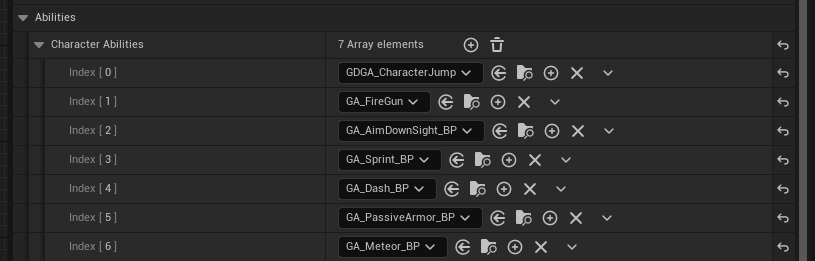

本文来分析瞄准，奔跑，被动装甲这三个GA的实现。

# 瞄准 GA_AimDownSight_BP

激活GA时，会应用一个GE

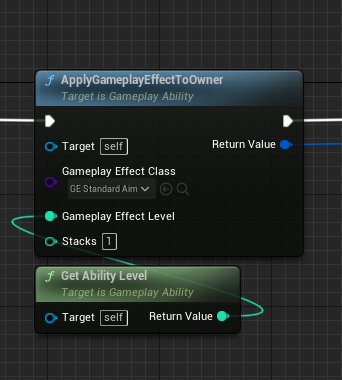

这个GE把State.AimDownSights这个Tag加到角色的ASC上

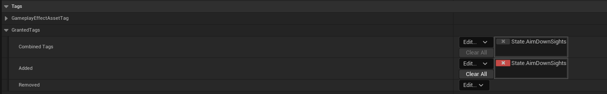

在角色动画蓝图的EventGraph里，会根据有无这个Tag，判断是否在瞄准状态，如果是瞄准状态，把瞄准动画的混合权重设置为1，从而播放瞄准动画。

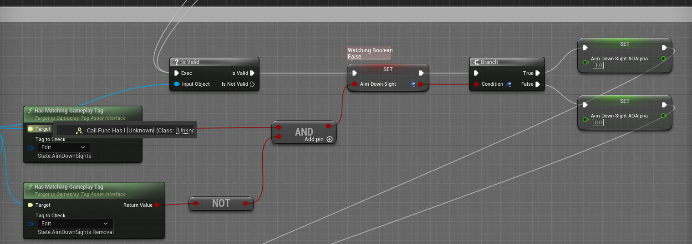

在角色的GetMaxSpeed()函数里，会根据当前是否在瞄准状态，乘上一个系数来降低移动速度。

```cpp
	if (RequestToStartADS)
	{
		return Owner->GetMoveSpeed() * ADSSpeedMultiplier;
	}
```

之后启动异步AbilityTask，等待输入释放，结束瞄准GA

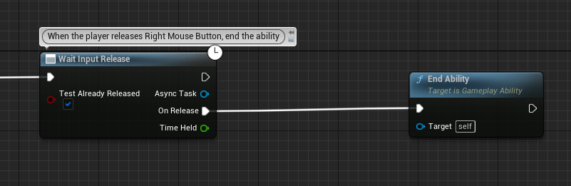

## WaitInputRelease

在启动Task时，会向ASC注册InputReleased的事件，传入对应的AbilitySpecHandle。之后在接收到输入释放的事件时，会根据这个注册事件Spec的InputID，调用注册的回调函数。

```cpp
void UAbilitySystemComponent::AbilityLocalInputReleased(int32 InputID)
{
	ABILITYLIST_SCOPE_LOCK();
	for (FGameplayAbilitySpec& Spec : ActivatableAbilities.Items)
	{
		if (Spec.InputID == InputID)
		{
			Spec.InputPressed = false;
			if (Spec.Ability && Spec.IsActive())
			{
				if (Spec.Ability->bReplicateInputDirectly && IsOwnerActorAuthoritative() == false)
				{
					ServerSetInputReleased(Spec.Handle);
				}

				AbilitySpecInputReleased(Spec);
				
				InvokeReplicatedEvent(EAbilityGenericReplicatedEvent::InputReleased, Spec.Handle, Spec.ActivationInfo.GetActivationPredictionKey());
			}
		}
	}
}
```

## OnEndAbility

在结束技能时，会先给ASC应用一个GE，这个GE的作用是添加一个State.AnimDownSights.Removal的Tag，告诉其他系统马上要结束瞄准状态了，之后再Remove掉这两个GE。从注释上看是为了预测，感觉有点意义不明，后面再看看。

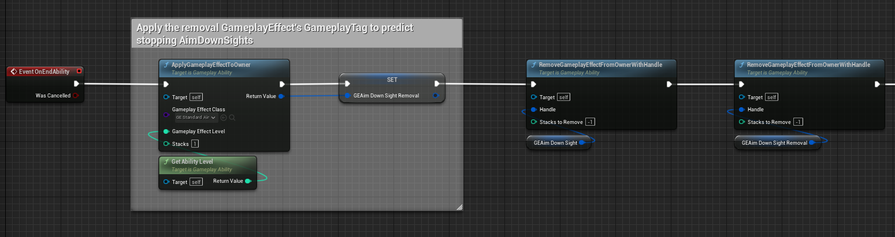

# 奔跑 GA_Sprint_BP

跟瞄准一样，在激活能力后会应用一个GE，添加一个State.Sprint的Tag。这个Tag在回体的被动GE里被用到(GE_StaminaRegen)，在拥有这个Tag的时候，不触发回体的GE

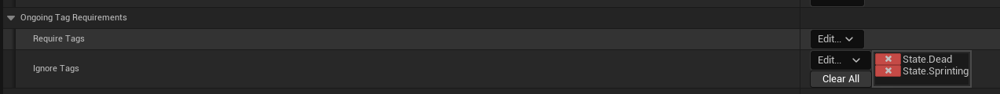

改变速度的逻辑也跟瞄准一样，不再赘述。冲刺动画使用二维BlendSpace，把速度和方向当作参数。

在激活奔跑时，会开启一个WaitDelay的异步AbilityTask，这个AbilityTask内部设置一个定时器，每隔指定时间调用一次回调，在项目里用于每0.05秒调用一次CommitAbilityCost消耗体力。当体力耗尽，Commit失败或者释放输入时，结束能力。

注意，当仅激活技能而没有移动时，不会CommitAbilityCost。

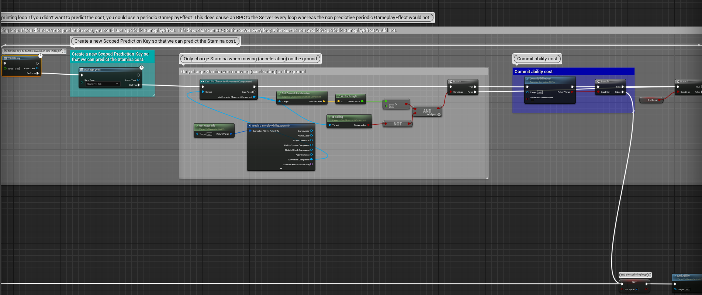

# 被动装甲 GA_PassiveArmor_BP

每隔4秒赋予一层减伤的被动装甲，当收到伤害时，扣除装甲层数，减少伤害。

通过重写OnAvatarSet，这个被动技能在赋予时就会被激活，ActivateAbilityOnGranted = true。

```cpp
void UGDGameplayAbility::OnAvatarSet(const FGameplayAbilityActorInfo * ActorInfo, const FGameplayAbilitySpec & Spec)
{
	Super::OnAvatarSet(ActorInfo, Spec);

	if (ActivateAbilityOnGranted)
	{
		bool ActivatedAbility = ActorInfo->AbilitySystemComponent->TryActivateAbility(Spec.Handle, false);
	}
}
```

当激活技能后，启动WaitDelayTask，每4秒赋予GE，添加一层装甲

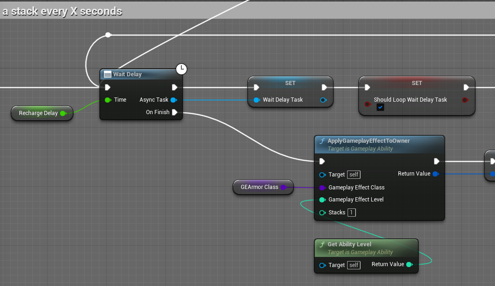

每次装甲层数改变时，判断当前是否等于最大层数，如果是，结束WaitDealyTask，不再每4秒添加层数。如果之前的层数为最大层数，当前层数不是最大层数，则重新启动WaitDealyTask，每4秒添加层装甲。

当每次收到伤害时，装甲层数-1

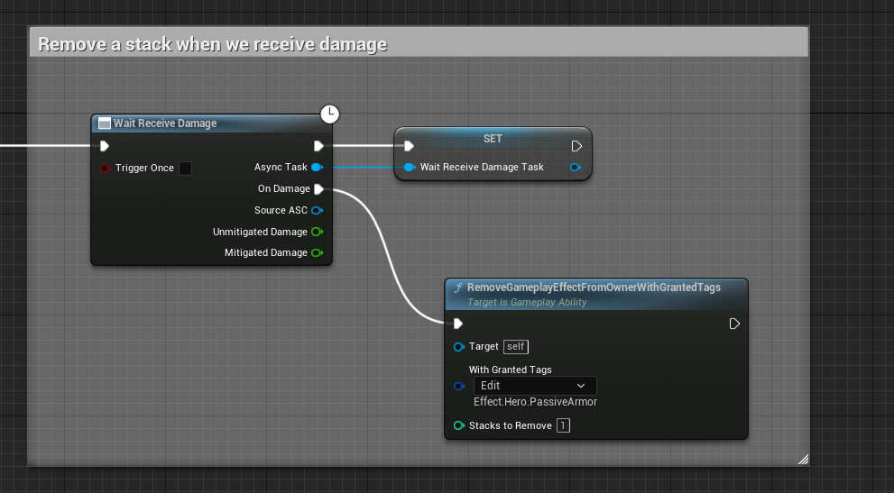

## GE_PassiveArmor

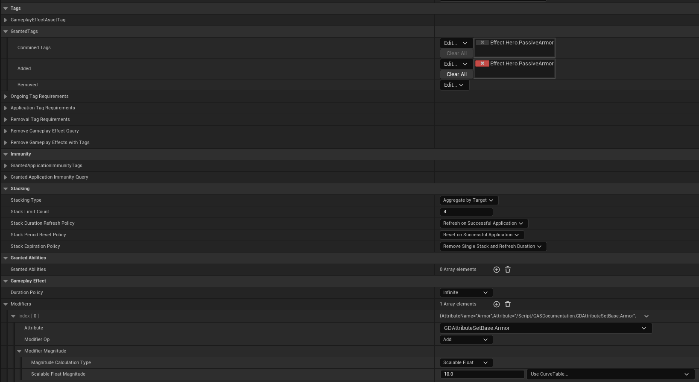

被动装甲的GE，向ASC添加Effect.Hero.PassiveArmor。当需要修改装甲层数时，通过该Tag找到对应GE。

修改AttributeBase.Armor，用于计算伤害公式减伤。


